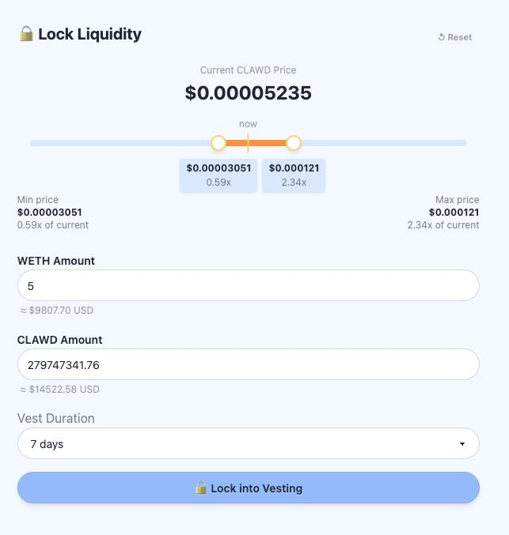

# 🦞 Liquidity Vesting

Lock WETH + CLAWD into a Uniswap V3 concentrated liquidity position and linearly vest liquidity back to the owner over a configurable duration. While locked, the position earns swap fees.

## Contracts (Base Mainnet)

- **LiquidityVesting v7**: [`0x7916773e871a832ae2b6046b0f964a078dc67ab4`](https://basescan.org/address/0x7916773e871a832ae2b6046b0f964a078dc67ab4)
- **Owner**: `0x90eF2A9211A3E7CE788561E5af54C76B0Fa3aEd0` (safe.clawd.atg.eth — 3/6 multisig)
- **WETH (token0)**: `0x4200000000000000000000000000000000000006`
- **CLAWD (token1)**: `0x9f86dB9fc6f7c9408e8Fda3Ff8ce4e78ac7a6b07`
- **Uniswap V3 Pool** (WETH/CLAWD 1%): `0xCD55381a53da35Ab1D7Bc5e3fE5F76cac976FAc3`
- **Uniswap V3 NonfungiblePositionManager**: `0x03a520b32C04BF3bEEf7BEb72E919cf822Ed34f1`

## Live UI

Deployed to IPFS via BGIPFS:
- https://community.bgipfs.com/ipfs/bafybeieheu7qqeedumwthei5dvpvujgpyzfsez2ibg74377zbut4ikundy/



## How It Works

1. Owner approves WETH + CLAWD to the contract
2. `lockUp(amount0Desired, amount1Desired, vestDuration, tickLower, tickUpper, amount0Min, amount1Min)` — creates a Uniswap V3 LP position at the specified tick range and starts the vest timer
3. Over `vestDuration` seconds, liquidity linearly unlocks
4. `vest()` — withdraws vested liquidity back to the owner
5. `claim()` — collects accumulated trading fees
6. `claimAndVest()` — does both atomically
7. `previewVest()` / `previewClaim()` — view functions for accurate tick-aware estimates

## Key Details

- **Default full-range ticks**: tickLower = -887200, tickUpper = 887200 (custom range also supported)
- **Slippage**: 5% on lockUp, vest, and claimAndVest
- **Security**: renounceOwnership disabled, sweep guards, isLocked guards, state cleared after final vest
- **Solc**: pinned to 0.8.26 (via-ir optimizer bug in newer versions affects sequential vest math)

## Frontend

Built with Scaffold-ETH 2 (Next.js + Wagmi + RainbowKit). Single-page UI shows contract status, lock/vest controls, and LP position preview.

## Development

```bash
# Start local chain
export PATH="$HOME/.foundry/bin:$PATH"
anvil &

# Deploy locally
forge script packages/foundry/script/DeployLiquidityVesting.s.sol \
  --rpc-url localhost \
  --account scaffold-eth-default \
  --password localhost \
  --broadcast --ffi
node packages/foundry/scripts-js/generateTsAbis.js

# Start frontend
cd packages/nextjs
yarn install
yarn start
```

## IPFS Deployment

```bash
# In packages/nextjs:
NEXT_PUBLIC_IPFS_BUILD=true yarn build
yarn bgipfs upload config init -u https://upload.bgipfs.com -k <BGIPFS_API_KEY>
yarn bgipfs upload out
```

## License

MIT
